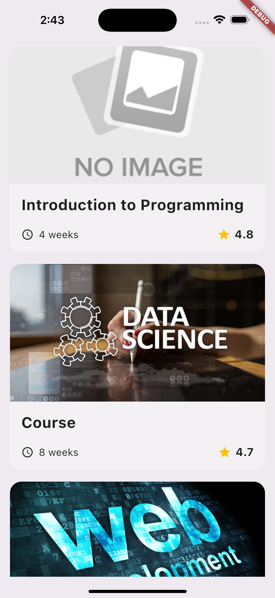
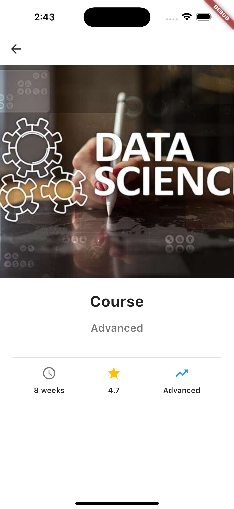

# Course App

A simple Flutter app that displays a list of courses and their details.

## Features

- Loads course data from JSON-style maps using a model.
- Displays courses with `ListView.builder`.
- Opens a details screen for each course.

## Screenshots

<p align="center">
  
  
</p>

## Run the app

```bash
flutter pub get
flutter run
```
